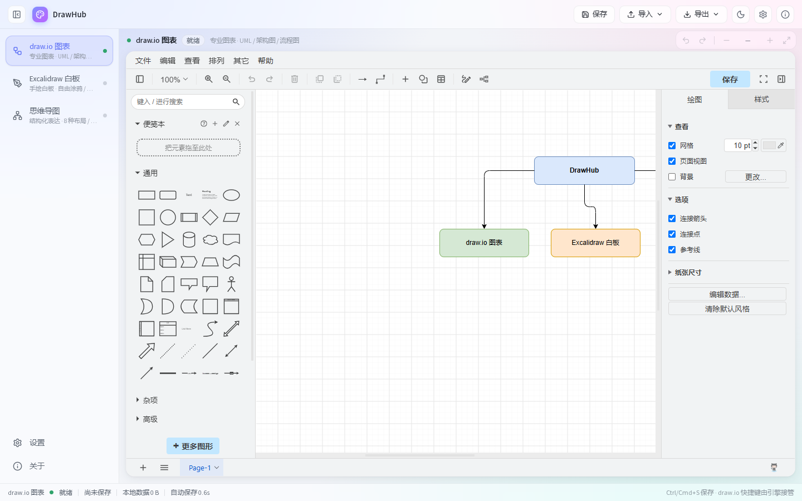
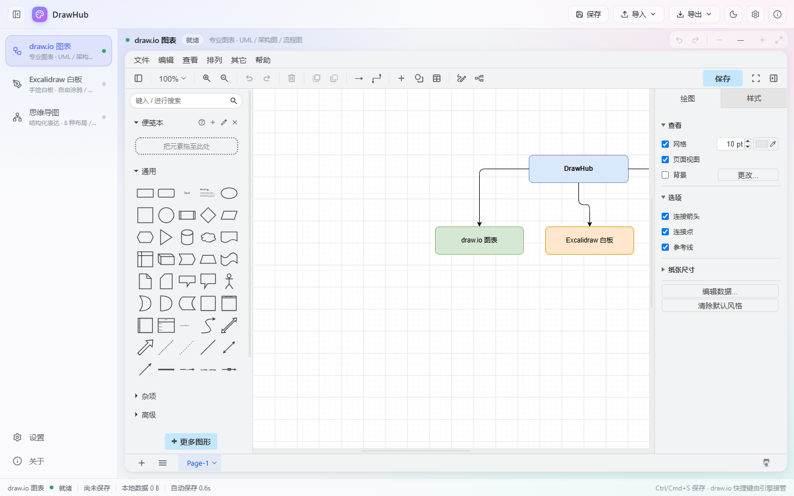
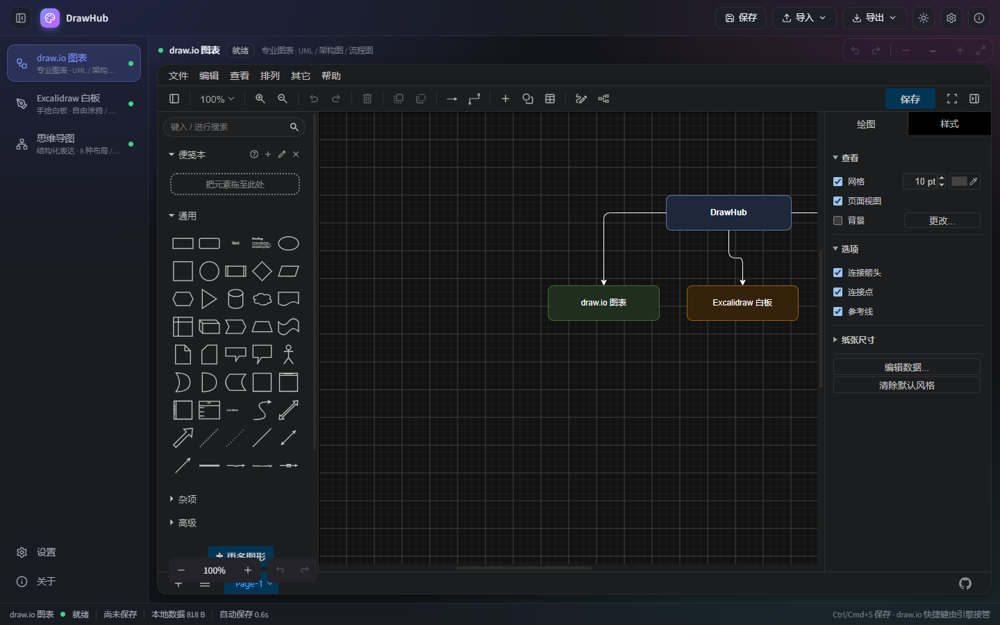

# 🎨 DrawHub

**一个窗口，三种画布 —— 聚合 draw.io / Excalidraw / 思维导图的本地绘图工具**


**纯前端 · 零后端 · 数据全部留在本地**

---

## 📸 预览

| draw.io 图表 | 思维导图 |
| :---: | :---: |
|  |  |
| **Excalidraw 白板** | **暗色主题** |
|  |  |

## 🤔 为什么需要 DrawHub

画图时你是否也在多个工具之间来回切换：流程图开 draw.io，草图开 Excalidraw，脑图开 XMind？**DrawHub 把三个最优秀的开源绘图引擎聚合进同一个界面**——左侧一键切换、数据统一存储、支持跨引擎导入导出，并且：

- 🔒 **隐私优先**：所有数据仅存于浏览器本地（localStorage + IndexedDB），无网络上传、无账号、无追踪
- 🪶 **秒开**：引擎按需懒加载，首屏仅约 29 KB JS + 19 KB CSS（gzip 后约 14 KB），访问哪个引擎才加载哪个
- 🌐 **在线/离线双模式**：draw.io 可切换为自托管实例，内网/离线环境也能用
- 💻 **可打包桌面应用**：基于 Tauri v2，产出原生安装包

## ✨ 功能特性

### 三引擎聚合

| 引擎 | 定位 | 核心能力 |
|------|------|----------|
| **draw.io** | 专业图表 · UML / 架构图 / 流程图 | 完整编辑器、图形库、撤销重做、缩放 |
| **Excalidraw** | 手绘白板 · 自由涂鸦 / 原型草图 | 手绘风格、实时协作风格画布、缩放适配 |
| **思维导图** (simple-mind-map) | 结构化表达 | 8 种布局、多种主题、撤销重做、缩放适配 |

### 统一命令层

通过 `EngineAdapter` 适配器模式，三大引擎对外暴露统一接口，UI 自动适配：

- 💾 **保存**：手动保存（`Ctrl/Cmd + S`）+ 防抖自动保存（间隔可配置）
- 📤 **导出**：各引擎支持 PNG / SVG / 源文件等格式（见下方格式矩阵）
- 📥 **导入**：支持导入对应格式文件（导入会覆盖当前画布，导入前有明确提示）
- 🔍 **缩放 / 撤销重做**：引擎不支持的能力自动置灰

### 导入 / 导出格式矩阵

| 引擎 | 导入 | 导出 |
|------|------|------|
| draw.io | `.drawio` `.xml` | PNG / SVG / draw.io XML |
| Excalidraw | `.excalidraw` `.json` | PNG / SVG / Excalidraw JSON |
| 思维导图 | `.json` `.smm` `.md` `.markdown` `.txt` `.xmind` | PNG / SVG / PDF / Markdown / JSON / XMind |

### 其他

- 🌗 **亮 / 暗主题**，毛玻璃（glassmorphism）视觉风格
- ⌨️ **全局快捷键**（见下表）
- 📊 **状态栏**：引擎加载状态、最近保存时间、本地存储占用
- 🧰 **数据管理**：一键导出/导入全部数据的 JSON 快照，支持迁移与回退；存储配额可视化
- 🛡️ **健壮存储**：小数据走 localStorage 同步读写，大对象（>256KB）自动转存 IndexedDB，配额超限自动提示

## ⌨️ 快捷键

| 快捷键 | 功能 |
|--------|------|
| `Ctrl/Cmd + S` | 保存当前图表 |
| `Ctrl/Cmd + 1 / 2 / 3` | 切换 draw.io / Excalidraw / 思维导图 |
| `Ctrl/Cmd + B` | 展开 / 收起侧边栏 |

> 画布内部快捷键（如 draw.io 的对齐、思维导图的 `Tab` / `Enter`）由各引擎自身接管。

## 🚀 快速开始

### 环境要求

- **Node.js ≥ 20**（推荐 22 LTS）
- npm（随 Node 附带）
- 联网（draw.io 默认嵌入官方在线服务；离线场景见下方《配置》章节）

### 端口约定

本项目统一使用 **200xx** 端口段：

| 用途 | 端口 | 来源 | 监听地址 |
|------|------|------|----------|
| 开发服务器（`npm run dev`） | 20001 | `vite.config.ts` → `server.port` | `0.0.0.0`（全部网卡） |
| 生产预览（`npm run preview`） | 20002 | `vite.config.ts` → `preview.port` | `0.0.0.0`（全部网卡） |
| draw.io 自托管示例（可选） | 20003 | 仅离线/内网部署时用到 | 由 draw.io 自身配置决定 |

> **端口被占用时** Vite 会自动顺延到下一个可用端口，**实际地址以终端输出为准**。

### 局域网访问

`vite.config.ts` 中已为开发服务器与预览服务设置 `host: true`（监听 `0.0.0.0`），因此除 `localhost` 外，同一局域网内的其他设备也可以用本机 IP 访问，例如：

```bash
npm run dev
# ➜  Local:   http://localhost:20001/
# ➜  Network: http://192.168.x.x:20001/   ← x.x 换成本机局域网 IP，给同事 / 手机访问
```

若其他设备访问不通，通常是 Windows 防火墙拦截，放行对应端口即可：

```powershell
# 以管理员身份运行（放行 20001 入站）
New-NetFirewallRule -DisplayName "DrawHub Dev 20001" -Direction Inbound -LocalPort 20001 -Protocol TCP -Action Allow
```

### 安装与运行

```bash
# 1. 克隆项目
git clone <your-repo-url> drawhub
cd drawhub

# 2. 安装依赖
npm install

# 3. 启动开发服务器（http://localhost:20001）
npm run dev
```

### 生产构建

```bash
# 类型检查 + 构建（产物在 dist/，base='./' 可直接静态托管或 file:// 场景分发）
npm run build

# 本地预览构建产物（http://localhost:20002）
npm run preview
```

### 桌面应用打包（可选）

项目已内置 Tauri v2 配置（`src-tauri/`），可打包为原生桌面应用：

```bash
# 前置：安装 Rust 工具链（https://rustup.rs）与平台构建依赖
# Windows 需要 Visual Studio Build Tools（C++ 桌面开发工作负载）

npm install -D @tauri-apps/cli   # 如尚未安装
npm run tauri dev                # 以桌面窗口运行
npm run tauri build              # 产出安装包（src-tauri/target/release/bundle/）
```

> 💡 **注意**：Windows 桌面端使用系统 WebView2；首次 `tauri build` 需下载 Rust 依赖，耗时较长属正常现象。

## ⚙️ 配置

所有设置位于应用内 **设置** 面板（顶栏 ⚙️ 图标），持久化于 `localStorage`：

| 设置项 | 默认值 | 说明 |
|--------|--------|------|
| 自动保存间隔 | 0.6 秒 | 防抖写入本地存储；切换引擎 / 关闭应用前强制落盘 |
| draw.io 嵌入地址 | `https://embed.diagrams.net/` | 可替换为自托管实例（如 `http://localhost:20003/`），支持内网/离线 |
| draw.io 数学公式 | 关闭 | MathJax 公式排版，开启后首次加载增加约 2MB |

### 自托管 draw.io（离线 / 内网部署）

```bash
# 使用官方发布包本地部署
git clone https://github.com/jgraph/drawio.git
cd drawio
npm install
npm run start   # draw.io 自带静态服务，官方默认监听 8080
```

> draw.io 官方默认端口是 8080；若希望与本项目统一到 200xx 段，在其启动脚本中把端口改为 20003 即可，下文按 20003 举例。

然后在 DrawHub **设置 → draw.io 引擎 → 嵌入地址** 填入 `http://localhost:20003/` 并点「应用」。

## 🏗️ 架构概览

```
┌─────────────────────────────────────────────────┐
│                   UI 外壳（App）                  │
│   TopBar / Sidebar / CanvasBar / StatusBar       │
├─────────────────────────────────────────────────┤
│              胶水层：Zustand Store                │
│   引擎切换 · 适配器注册表 · Toast · 设置 · 用量     │
├──────────────┬──────────────┬───────────────────┤
│  DrawIOView  │ ExcalidrawView│    MindMapView    │
│ iframe+消息协议│  React 组件   │     纯 JS 实例     │
│  (懒加载分包) │  (懒加载分包)  │    (懒加载分包)    │
├──────────────┴──────────────┴───────────────────┤
│        统一存储服务 storage（localStorage +       │
│        IndexedDB 分层，快照导出/导入）             │
└─────────────────────────────────────────────────┘
```

**核心设计 —— EngineAdapter 适配器模式**：每个引擎在挂载时向 Store 注册实现 `EngineAdapter` 接口的适配器（`save` / `exportAs` / `importAs` / `zoomIn` …），顶栏与快捷键等胶水层只面向接口编程，引擎不支持的能力 UI 自动置灰。新增引擎只需：实现一个 View 组件 + 注册适配器 + 在 `ENGINE_META` 补充元信息。

**draw.io 集成细节**（踩坑记录，接入方必读）：

- 采用 iframe 嵌入 embed.diagrams.net + `postMessage` 通信，协议要求**双向消息均为 JSON 字符串**（出站 `JSON.stringify`，入站先 `JSON.parse`，传对象会静默失败）
- 自动保存由 **`load` 消息体的 `autosave: 1` 字段**开启，URL 参数无效
- 冷启动需下载约 22MB 资源（约 5~22 秒），之后有浏览器缓存

## 🗂️ 目录结构

```
drawhub/
├── src/
│   ├── App.tsx                  # 应用外壳 + 引擎懒加载调度
│   ├── constants.ts             # 引擎元信息（导入导出格式等）
│   ├── types.ts                 # EngineAdapter 等核心类型
│   ├── components/
│   │   ├── TopBar.tsx           # 顶栏：保存/导入/导出/主题/设置
│   │   ├── Sidebar.tsx          # 侧边栏：引擎切换 + 状态点
│   │   ├── CanvasBar.tsx        # 画布工具条：撤销重做/缩放
│   │   ├── StatusBar.tsx        # 状态栏：引擎状态/保存时间/存储占用
│   │   ├── ImportMenu.tsx       # 统一导入菜单
│   │   ├── ExportMenu.tsx       # 统一导出菜单
│   │   ├── ToastHost.tsx        # 全局 Toast
│   │   ├── dialogs/             # 设置 / 关于
│   │   └── engines/             # 三大引擎视图（各自懒加载分包）
│   ├── hooks/                   # 全局快捷键
│   ├── services/                # localStorage + IndexedDB 分层存储
│   ├── store/                   # Zustand 全局状态
│   └── utils/                   # 下载 / 文件读取工具
├── src-tauri/                   # Tauri v2 桌面打包配置
├── docs/                        # 设计文档 / 截图
├── vite.config.ts               # 构建配置（引擎分包由动态 import 驱动）
└── package.json
```

## ❓ FAQ

**Q: draw.io 打不开 / 一直转圈？**

1. **首次进入较慢是正常的**：draw.io 冷启动需从官网下载约 22MB 资源（约 5~22 秒），之后有缓存会明显变快。状态栏显示引擎加载状态，请耐心等待。
2. **确认网络可达**：默认嵌入官方服务 `embed.diagrams.net`，需能访问外网；内网环境请按上文自托管后替换嵌入地址。
3. **不要用 `file://` 双击打开 `index.html`**：不透明来源下 iframe 内的 localStorage 会抛 SecurityError，draw.io 与本地存储均失效。请始终使用 `npm run dev` 或 `npm run preview` 启动（应用检测到 `file://` 时会主动提示）。

**Q: 我的数据存在哪里？安全吗？**

全部数据（画布内容、主题、设置）仅保存在**本机浏览器**的 localStorage 与 IndexedDB 中，不上传任何服务器。清理浏览器站点数据会删除它们，建议定期在 **设置 → 数据管理** 中导出 JSON 备份。

**Q: 切换引擎后内容会丢吗？**

不会。每个引擎首次访问后保持挂载（仅隐藏），编辑状态实时防抖落盘；切换回来自动恢复。刷新页面后从本地存储重建。

**Q: 导入文件会覆盖现有内容吗？**

会。导入是将文件内容载入**当前画布**，覆盖现有内容（菜单中有明确提示）；格式校验失败则不会改动画布。如需保留当前内容，请先导出或备份数据。

## 🛠️ 技术栈

| 类别 | 选型 |
|------|------|
| 框架 | React 19 + TypeScript 5.9 |
| 构建 | Vite 8（Rolldown），引擎级代码分割（React.lazy） |
| 状态 | Zustand 5 |
| 引擎 | draw.io（iframe embed）、@excalidraw/excalidraw 0.18、simple-mind-map 0.13 |
| 图标 | lucide-react |
| 桌面 | Tauri v2（可选） |

## 🔗 同类开源项目

> 便于横向对比与选型参考。DrawHub 集成的三个引擎本身也是开源项目，此处一并列出。

### 聚合绘图（同类思路）

- [AI Draw Nexus](https://github.com/hkxiaoyao/ai-draw-nexus) — 同类「聚合绘图」思路参考
- [tldraw](https://github.com/tldraw/tldraw) — 开源白板 / 图表引擎，React 原生、可扩展性强

### 图表

- [draw.io](https://github.com/jgraph/drawio) — 最强大的开源图表工具（DrawHub 已集成）
- [Mermaid](https://github.com/mermaid-js/mermaid) — 文本驱动的图表生成，适合与 Markdown 结合
- [D2](https://github.com/terrastruct/d2) — 声明式图表语言，主打「图即代码」

### 白板 / 手绘

- [Excalidraw](https://github.com/excalidraw/excalidraw) — 手绘风虚拟白板（DrawHub 已集成）
- [tldraw](https://github.com/tldraw/tldraw) — 功能更强的白板 SDK（含协作、绑定等）

### 思维导图

- [simple-mind-map](https://github.com/wanglin2/mind-map) — 功能最全的 Web 思维导图库（DrawHub 当前使用）
- [mind-elixir-core](https://github.com/ssshooter/mind-elixir-core) — 框架无关、体积小（约 15KB gzip）、性能好，适合自定义
- [markmap](https://github.com/markmap/markmap) — 从 Markdown 自动生成思维导图，轻量美观
- [jsmind](https://github.com/hizzgdev/jsmind) — 老牌开源思维导图，稳定、依赖少
- [butterfly](https://github.com/alibaba/butterfly) — 蚂蚁开源节点编排 / 流程图库，可自定义节点实现思维导图

## 🗺️ 路线图

完整规划见 [`docs/未来功能升级.md`](docs/未来功能升级.md)（按近/中/远期分类，每条含目标、痛点、设计、验收、估时）。

### 速览

**近期待办（v0.4–v0.5）**

- [x] 思维导图显示优化：关闭 `view.fit()`、强制 SVG 字体覆盖、CSS 兜底
- [ ] 思维导图引擎替换 → mind-elixir-core（详见 [替换方案](docs/思维导图引擎替换方案.md)）
- [ ] 多文档 / 文件树
- [ ] 全局搜索（跨引擎 / 跨文档）
- [ ] 桌面端自动更新（Tauri updater）
- [ ] 导出 ZIP 打包（多文档一键导出）

**中期规划（v0.6–v0.8）**

- [ ] 接入 Mermaid / Markmap / PlantUML / 甘特
- [ ] 跨引擎互转（drawio XML ⇄ Excalidraw JSON ⇄ 思维导图 JSON）
- [ ] AI 润色 / 一键美化（本地 LLM 优先）
- [ ] 协同编辑（Yjs + WebSocket）

**远期愿景（v1.0+）**

- [ ] DrawHub Cloud（端到端加密云端备份）
- [ ] 插件市场
- [ ] 移动端壳（Tauri Android/iOS）
- [ ] WebGPU 硬件加速

> 完整设计见 [docs/DrawHub 设计文档.md](docs/DrawHub%20设计文档.md)（含架构决策、风险清单与版本记录），未来功能升级详见 [docs/未来功能升级.md](docs/未来功能升级.md)。

## 🤝 贡献

欢迎 Issue 与 PR！提交前请确保：

```bash
npm run build   # 通过 tsc 类型检查与构建
```

**Issue** 请按类型使用模板（仓库根目录 `.github/ISSUE_TEMPLATE/`）：

- Bug → 「Bug Report」
- 新功能 → 「Feature Request」（先查 [`docs/未来功能升级.md`](docs/未来功能升级.md) 避免重复）
- 文档疑问 / 设计讨论 → 「Docs / Question」

**PR** 请使用仓库根目录 `.github/PULL_REQUEST_TEMPLATE.md`，commit message 遵循 [Conventional Commits](https://www.conventionalcommits.org/zh-hans/)（`feat:` / `fix:` / `docs:` / `refactor:` / `chore:` / `perf:`）。

CI 会自动跑 `npm ci && npm run build`，请确保在本地通过后再提 PR。

## 📄 许可证

本项目代码以 [MIT](LICENSE) 协议开源。集成的引擎遵循各自协议：draw.io（Apache-2.0）、Excalidraw（MIT）、simple-mind-map（MIT）。

## 🙏 致谢

- [draw.io](https://github.com/jgraph/drawio) — 最强大的开源图表工具
- [Excalidraw](https://github.com/excalidraw/excalidraw) — 手绘风虚拟白板
- [simple-mind-map](https://github.com/wanglin2/mind-map) — 思维导图库
- [Tauri](https://v2.tauri.app/) — 轻量级桌面应用框架

---

**DrawHub** · 一个窗口，画遍所有想法 🎨
